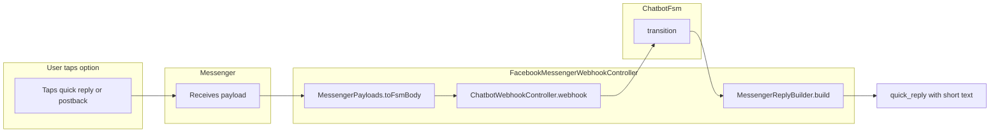

# Messenger: Persistent Menu Fix + Minimize Numeric Prompts

This plan is in Markdown. A copy can be saved in the project at `docs/MESSENGER_AND_REPLIES_CUSTOMIZATION_PLAN.md` for version control and team reference.

---

## Problem

1. **Persistent menu fails** with `(#100) You must set a Get Started button if you also wish to use persistent menu` because Facebook requires `get_started` to be set before `persistent_menu`.
2. **Redundant numeric prompts in Messenger** – When the app already shows quick replies or buttons, the text still says "Reply 1, 2, 3" or "Choose language: 1=English, 2=Tagalog". Users should tap options, not type numbers.

---

## Part 1: Fix Persistent Menu (Get Started)

**File:** `texttoeat-app/app/Messenger/FacebookMessengerClient.php`

In `setPersistentMenu`, include `get_started` in the same API call:

```php
->post($endpoint, [
    'get_started' => [
        'payload' => 'MAIN_HOME',
    ],
    'persistent_menu' => [
        [
            'locale' => 'default',
            'call_to_actions' => $callToActions,
        ],
    ],
])
```

`MAIN_HOME` is mapped in `MessengerPayloads` to `main`, so tapping Get Started sends the user to the main menu. No changes needed in the webhook.

---

## Scope: Messenger only, SMS unchanged

- **SMS:** No changes. SMS continues to use the full reply strings from `lang/*/chatbot.php` (e.g. "Choose language: 1=English, 2=Tagalog, 3=Ilocano", "Reply 1, 2, 3..."). Users still reply with numbers; the ChatbotFsm and SMS path are unchanged.
- **Messenger:** Only the Messenger path is affected. `FacebookMessengerWebhookController` uses `MessengerReplyBuilder`; that builder will use short prompts from `chatbot.messenger.*` when rendering quick replies/buttons. The same ChatbotFsm and webhook response are used; only the **display text** sent to Messenger is shortened.

---

## Part 2: Minimize Numeric Prompts in Messenger

**Current behavior:** `MessengerReplyBuilder` already returns `quick_reply`, `button_template`, or `carousel` for: `language_selection`, `main_menu`, `track_choice`, `delivery_choice`, `confirm`, and `menu`. However, it uses the full `reply` text from the chatbot (e.g. "Choose language: 1=English, 2=Tagalog, 3=Ilocano"), which duplicates the options that appear as buttons.

**Approach:** When Messenger shows quick replies or buttons, use short headings instead of the full numeric prompt.

### 2.1 Add Messenger-specific lang keys

**File:** `texttoeat-app/lang/en/chatbot.php`

Add a `messenger` section with short prompts (no numbers):

```php
'messenger' => [
    'choose_language' => 'Choose language:',
    'main_menu' => 'What would you like to do?',
    'track_choice' => 'Choose:',
    'delivery_choice' => 'How would you like to receive your order?',
    'menu_header' => "Here's our menu:",
],
```

For `confirm`, keep the full reply (it contains the order summary); the buttons already make the action clear. For `track_list`, `cart_menu`, `collect_name`, etc., these stay as plain text; adding quick replies there would require more structural changes and is out of scope for this "minimize" pass.

### 2.2 Add localized prompts for Tagalog and Ilocano

**Files:** `lang/tl/chatbot.php`, `lang/ilo/chatbot.php` (if they exist)

Add matching `messenger` keys. Fallback to `en` if locale-specific keys are missing.

### 2.3 Use Messenger prompts in MessengerReplyBuilder

**File:** `texttoeat-app/app/Messenger/MessengerReplyBuilder.php`

- Use `__()` to resolve `chatbot.messenger.*` keys by locale.
- In `build()`, when returning `quick_reply` or `button_template` for `language_selection`, `main_menu`, `track_choice`, or `delivery_choice`, set `text` to the Messenger prompt instead of the full `$reply`.
- For `menu` (carousel), use the Messenger `menu_header` for the carousel header text.
- For `confirm`, keep the full `$reply` (it has the order summary); the "Reply yes/1" part is redundant but stripping it would require parsing or summary reconstruction.

---

## Data flow (unchanged)



The FSM and chatbot logic stay the same; only the **displayed text** in Messenger changes from "Choose language: 1=English, 2=Tagalog..." to "Choose language:" when quick replies are shown.

---

## Summary of changes

| File | Change |
|------|--------|
| `app/Messenger/FacebookMessengerClient.php` | Add `get_started` to the `messenger_profile` payload in `setPersistentMenu` |
| `lang/en/chatbot.php` | Add `messenger` section with short prompts |
| `lang/tl/chatbot.php`, `lang/ilo/chatbot.php` | Add `messenger` section (if these files exist) |
| `app/Messenger/MessengerReplyBuilder.php` | Use Messenger prompts for `quick_reply`/`button_template` in `language_selection`, `main_menu`, `track_choice`, `delivery_choice`; use Messenger `menu_header` for carousel |

---

## Out of scope (this phase)

- `track_list` ("Reply with the number to see status") – dynamic options per user
- `cart_menu`, `item_selection` – complex flows with variable options
- `collect_name` – free text; no quick replies

---

## Future: Replies customization page (planned)

A dedicated admin page to customize chatbot reply text, so non-developers can change prompts without editing lang files.

### Purpose

- Edit the strings users see (SMS and/or Messenger) from the Portal.
- Optionally separate SMS vs Messenger wording (e.g. keep numeric prompts for SMS, short prompts for Messenger) or shared prompts.
- Support at least English; consider locale (en, tl, ilo) later.

### Placement

- **Portal (admin):** e.g. **Settings → Chatbot replies** or **Portal → Replies**.
- Route: `GET/POST /portal/chatbot-replies` (or under an existing settings section).
- Middleware: `auth`, `admin` (same as other portal pages).

### What can be customized (candidate list)

- **Shared / SMS:** `welcome`, `language_prompt`, `main_menu_prompt`, `track_choice_prompt`, `delivery_choice_prompt`, `menu_header`, `menu_footer`, `confirm_prompt`, `cart_menu_prompt`, `collect_name_prompt`, `order_placed`, `human_takeover_reply`, etc.
- **Messenger-only (short):** `messenger.choose_language`, `messenger.main_menu`, `messenger.track_choice`, `messenger.delivery_choice`, `messenger.menu_header`.

Either one list with an optional "Messenger short" override per key, or two sections (SMS/shared vs Messenger).

### Storage options

1. **Database:** New table e.g. `chatbot_reply_overrides` (key, locale, channel, value). App loads lang from Laravel lang files, then applies overrides from DB (e.g. in a custom Lang loader or in the code that builds replies).
2. **Lang files only:** No DB; the page could be a read-only reference of current keys, with a link to edit in repo / env. Less flexible.
3. **Hybrid:** Defaults from lang files; overrides in DB. Prefer this so deployments don't lose custom text.

### Implementation notes (deferred)

- New migration for overrides table (if DB used).
- Service or helper that returns reply text for a given key/locale/channel (lang + overrides).
- ChatbotFsm (and/or MessengerReplyBuilder) would need to use this provider instead of raw `__('chatbot.xxx')` where overridable keys are used.
- UI: form with key labels and text inputs (and locale/channel selectors if multi-locale/channel). Save → store overrides and optionally clear cache.

This is **planned only**; no implementation in the current scope. The plan document can be copied to the project as `docs/MESSENGER_AND_REPLIES_CUSTOMIZATION_PLAN.md` for reference.
